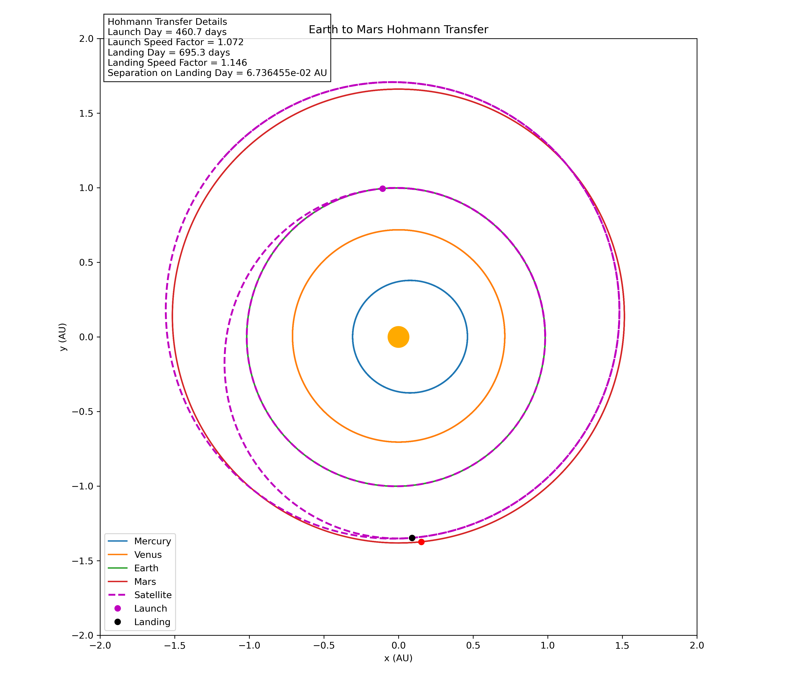

# Hohmann Transfer Simulation

Python orbital mechanics simulation modeling an Earth-to-Mars transfer using Euler-Cromer numerical integration.
The program numerically propagates the motion of Mercury, Venus, Earth, Mars, and a spacecraft under the Sun's gravitational field, then visualizes the resulting transfer trajectory through both a static plot and an animated simulation.

## Overview

The simulation models five years of orbital motion using a time step of 0.1 days.
At each time step, the gravitational acceleration of each object is calculated from:

`a = -GM r / |r|^3`

Velocity and position are then updated using the Euler-Cromer method.
The spacecraft begins at Earth's position and receives two velocity adjustments representing the departure and arrival burns of the transfer.

## Numerical Method

The Euler-Cromer integration method updates velocity before position:

`v(t + dt) = v(t) + a(t)dt`

`r(t + dt) = r(t) + v(t + dt)dt`

This method is used to propagate the planetary and spacecraft trajectories throughout the simulation.

## Transfer Parameters

The modeled transfer uses:
- Launch day: 460.7 days
- Launch velocity factor: 1.072
- Arrival adjustment day: 695.3 days
- Arrival velocity factor: 1.146
- Simulation duration: 1825 days
- Time step: 0.1 days
The velocity factors multiply the spacecraft's instantaneous velocity at each burn.

## Results

The simulation produced:
- Satellite aphelion: approximately 1.351 AU
- Aphelion reached near day 686
- Separation from Mars on the selected arrival day: approximately 0.0674 AU
- Closest simulated spacecraft-Mars separation: approximately 0.00420 AU
The model demonstrates the sensitivity of an interplanetary transfer to orbital timing, initial conditions, and velocity changes.

## Transfer Trajectory

The completed simulation shows the planetary orbits, spacecraft trajectory, launch point, and selected arrival point.

## Animation

The animation visualizes the evolution of the planetary system and spacecraft trajectory over time.

## Technologies

- Python
- NumPy
- Matplotlib
- Matplotlib Animation
- Pillow

## Model Limitations

This is a simplified numerical orbital model rather than a high-fidelity mission design tool.
Key limitations include:
- Planetary motion is modeled in two dimensions
- Only the gravitational influence of the Sun is included
- Planet-planet and spacecraft-planet gravitational interactions are neglected
- Initial planetary conditions use perihelion orbital data
- Transfer burns are represented using velocity scaling factors
- The selected arrival day does not exactly coincide with the model's global closest approach to Mars
- Numerical accuracy depends on the Euler-Cromer integration time step

Future improvements could include analytical Hohmann transfer calculations, optimized launch-window selection, delta-v calculations, higher-order numerical integration, and three-dimensional orbital elements.

## Sources

Orbital and physical parameters were referenced from:

- NASA Space Science Data Coordinated Archive (NSSDCA) Planetary Fact Sheets
- NASA NSSDCA Sun Fact Sheet
- NIST CODATA fundamental physical constants

Planetary perihelion distances and orbital velocities were converted into AU and AU/day for use in the numerical model.
